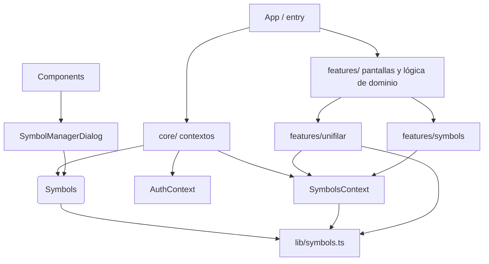
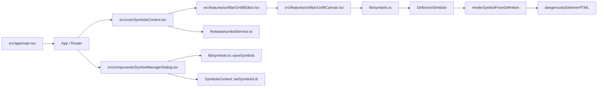

# IEBA Suite - Estructura del Proyecto

## Resumen general

Este proyecto es una suite de herramientas para electricistas, construida en React + TypeScript. Incluye módulos de:

- autenticación (`auth`)
- hub de clientes y proyectos (`hub`)
- mediciones (`measurements`)
- perfil de usuario (`profile`)
- relevadores y protecciones (`relevador`)
- gestión de símbolos eléctricos (`symbols`)
- editor de diagrama unifilar (`unifilar`)

También ofrece:

- biblioteca de símbolos SVG
- administración y edición de símbolos personalizados
- persistencia local y sincronización opcional con Firebase

La app se construye con Vite y organiza la lógica en componentes, contextos y utilidades separadas por responsabilidad.

---

## Estructura principal del repositorio

```text
.
├── package.json
├── tsconfig.json
├── vite.config.ts
├── public/
│   ├── manifest.json
│   ├── symbols.json
│   └── icons/
└── src/
    ├── App.css
    ├── app/
    │   ├── HubRouter.tsx
    │   └── main.tsx
    ├── components/
    │   ├── AppHeader.tsx
    │   ├── ExportDialog.tsx
    │   ├── NetlistReport.tsx
    │   ├── SymbolDialog.tsx
    │   └── SymbolManagerDialog.tsx
    ├── core/
    │   ├── AuthContext.tsx
    │   ├── ClientContext.tsx
    │   ├── EditorTabContext.tsx
    │   ├── ProfileContext.tsx
    │   ├── ProjectContext.tsx
    │   ├── SymbolsContext.tsx
    │   └── ...
    ├── features/
    │   ├── auth/
    │   ├── hub/
    │   ├── measurements/
    │   ├── profile/
    │   ├── relevador/
    │   ├── symbols/
    │   └── unifilar/
    ├── firebase/
    ├── hooks/
    ├── lib/
    │   ├── geometry.ts
    │   ├── layout.ts
    │   ├── storage.ts
    │   ├── symbols.ts
    │   └── renderer/
    ├── styles/
    ├── types/
    ├── ui/
    └── utils/
```

### Cartera de features

- `src/features/auth/`: Autenticación de usuarios y estado de sesión.
- `src/features/hub/`: Hub de clientes, proyectos y resumenes.
- `src/features/measurements/`: Herramientas de mediciones eléctricas.
- `src/features/profile/`: Pantalla de perfil de usuario.
- `src/features/relevador/`: Gestión de relevadores y protecciones.
- `src/features/symbols/`: Biblioteca y editor de símbolos SVG.
- `src/features/unifilar/`: Editor y renderizador de diagrama unifilar.

---

## Mapa de módulos principales



---

## Archivos clave y responsabilidades

### `package.json`
- Define dependencias principales: `react`, `react-dom`, `react-router-dom`, `firebase`.
- Usa `vite` como bundler.
- Contiene scripts básicos: `dev`, `build`, `lint`, `preview`.

### `public/symbols.json`
- Contiene la biblioteca canónica de símbolos SVG.
- Cada símbolo tiene campos como `id`, `label`, `escalaBase`, `anclaje`, `uso`, `categoria`, `svgContent`.
- Los símbolos unifilares se renderizan a partir de este JSON.

---

## `src/lib/symbols.ts`

Este módulo es la fuente de verdad de los símbolos.

Funciones principales:

- `getDefaultSymbolsSync()`
  - Carga la lista de símbolos estándar desde `public/symbols.json`.

- `getDefaultCategoriesSync()`
  - Carga las categorías de símbolo estándar.

- `getSymbolsByUsoSync(uso?)` y `getSymbolsByCategorySync(categoria?)`
  - Filtran símbolos por `uso` o `categoria`.

- `loadCustomSymbolsFromStorage()`
  - Lee símbolos personalizados guardados en `localStorage`.
  - Retorna un arreglo vacío si no hay datos o hay error.

- `saveSymbols(symbols)`
  - Guarda la librería completa en `localStorage`.

- `fetchSymbolsFile()` y `fetchDefaultSymbols()`
  - Métodos asíncronos que cargan `symbols.json` vía fetch.
  - Actualmente se consideran `@deprecated` frente a las funciones síncronas.

Tipos importantes:

- `DefinicionSimbolo`
  - `id`, `label`, `svgContent`, `escalaBase`, `anclaje`, `uso`, `categoria`, `pins`.

- `SymbolPin`
  - Define puntos de conexión normalizados para los símbolos.

---

## `src/core/SymbolsContext.tsx`

Gestiona la librería de símbolos en el contexto global.

Funciones / hooks principales:

- `SymbolsProvider`
  - Inicializa `symbolsLib` con la unión de símbolos por defecto y símbolos custom locales.
  - Usa `getDefaultSymbolsSync()` y `loadCustomSymbolsFromStorage()`.
  - Expone `symbolsLib`, `categoriesLib` y `setSymbolsLib`.
  - Sincroniza con Firebase cuando hay usuario autenticado.
  - Al sincronizar, descarga símbolos remotos, mezcla con defaults y guarda localmente.

- `updateSymbols`
  - Actualiza el estado local.
  - Guarda la librería completa en `localStorage`.
  - Si hay usuario, sube solo los símbolos custom remotos (`sym-custom-...`).

- `useSymbols()`
  - Hook que asegura que el contexto se use dentro de `SymbolsProvider`.

---

## `src/features/unifilar/UnifilCanvas.tsx`

Renderiza el canvas del diagrama unifilar.

Funciones importantes:

- `getSymbolViewBoxSize(svgContent)`
  - Extrae el ancho y alto desde el `viewBox` de un SVG embebido.
  - Permite calcular la escala real del símbolo.

- `getSymbolScale(symbol, targetSize)`
  - Calcula la escala del símbolo en función del `viewBox` y `escalaBase`.
  - Si no hay `viewBox`, usa un fallback basado en 20 unidades.

- `renderSymbolFromDefinition(symbol, size, selected)`
  - Renderiza el SVG del símbolo con `dangerouslySetInnerHTML`.
  - Aplicar un color de selección y un fondo si el nodo está activo.

- `getSymbolComponent(tipo, node, selected, symbolsLib)`
  - Busca el `symbolDef` correspondiente al tipo de nodo en `UNIFIL_SYMBOL_IDS`.
  - Renderiza el símbolo desde la librería si existe.
  - Si no existe, usa un fallback simple con un rectángulo y texto.

- `getNodeAnchor(node, symbolsLib, prefer)`
  - Obtiene la posición de anclaje para conexiones entre nodos.
  - Si el símbolo define `pins`, usa esos pines.
  - Si no, usa un fallback superior/inferior.

Renderizado del canvas:

- Calcula `canvasBounds` según posiciones de nodos y padding.
- Renderiza bordes (`edgesGroup`) con líneas entre anclas.
- Renderiza nodos con `nodesGroup` y permite seleccionar nodos.

---

## `src/components/SymbolManagerDialog.tsx`

Diálogo para importar, editar y eliminar símbolos personalizados.

Funciones importantes:

- `handleFileChange(e)`
  - Carga un archivo `.svg` desde el input.
  - Extrae el contenido SVG con `parseSvgFileContent()`.
  - Crea un nuevo símbolo personalizado con `sym-custom-...`.
  - Agrega el símbolo a la librería y abre el modo edición.

- `handleSaveEdit()`
  - Guarda los cambios del símbolo que se está editando.
  - Actualiza `symbolsLib` y persiste en `localStorage`.

- `handleDelete(id)`
  - Elimina símbolos personalizados (no los símbolos por defecto).
  - Solicita confirmación antes de borrar.

Interfaz:

- Lista símbolos disponibles con vista previa SVG.
- Botón `+ Importar SVG` para subir nuevos símbolos.
- Formulario de edición para `label`, `escalaBase`, `svgContent` y `pins`.

---

## Flujo de símbolos unifilares

1. La librería se carga desde `public/symbols.json` a través de `lib/symbols.ts`.
2. `SymbolsProvider` mezcla símbolos por defecto con personalizados.
3. `UnifilCanvas` consume `symbolsLib` usando `useSymbols()`.
4. Cada nodo unifilar obtiene su símbolo por `tipo` y se renderiza desde SVG.
5. Los pines del símbolo determinan las anclas de las conexiones.
6. La gestión de símbolos personalizados se realiza en `SymbolManagerDialog` y se persiste localmente.

---

## Notas adicionales

- La carpeta `src/features/unifilar/symbols/` estaba vacía y el renderizado ya no depende de componentes hardcodeados.
- `symbols.json` es la fuente de verdad para los símbolos `unifilar` y `planta`.
- El proyecto utiliza `currentColor` para permitir que los SVG hereden el color del contexto.

---

## Recomendaciones de lectura rápida

- Para entender la carga de símbolos: `src/lib/symbols.ts`
- Para ver la lógica del editor unifilar: `src/features/unifilar/UnifilCanvas.tsx`
- Para controlar la persistencia de símbolos: `src/core/SymbolsContext.tsx`
- Para editar e importar símbolos: `src/components/SymbolManagerDialog.tsx`

---

## Puntos de entrada

- `src/app/main.tsx`
  - Inicializa React y envuelve la aplicación con proveedores globales.
- `src/app/HubRouter.tsx`
  - Define la navegación y las pantallas principales de la aplicación.
- `src/core/SymbolsContext.tsx`
  - Provee `symbolsLib` a toda la aplicación.
- `src/features/unifilar/UnifilEditor.tsx`
  - Pantalla principal del editor unifilar.
- `src/features/unifilar/UnifilCanvas.tsx`
  - Dibuja el diagrama unifilar en SVG.
- `src/components/SymbolManagerDialog.tsx`
  - Interfaz para importar y editar símbolos.

---

## Flujo de renderizado y gestión de símbolos



### Flujo de importación de símbolos

1. El usuario sube un archivo SVG en `SymbolManagerDialog`.
2. `handleFileChange()` parsea el SVG y crea un nuevo `DefinicionSimbolo`.
3. `onUpdate()` actualiza `symbolsLib` en el contexto.
4. `saveSymbols()` persiste la librería en `localStorage`.
5. Si hay sesión activa, `SymbolsContext` sincroniza los símbolos custom a Firebase.

---

## Observaciones de diseño

- El proyecto separa claramente la carga de datos (`lib/symbols.ts`) de la visualización (`features/unifilar/UnifilCanvas.tsx`).
- `symbols.json` es la fuente canónica; los símbolos custom se guardan con `sym-custom-` y se fusionan con los defaults.
- `currentColor` en los SVG permite colorear símbolos desde el contexto del canvas.
- La carpeta `src/features/unifilar/symbols/` ya no se usa para los símbolos de diagrama; el renderizado depende únicamente de la biblioteca JSON.
